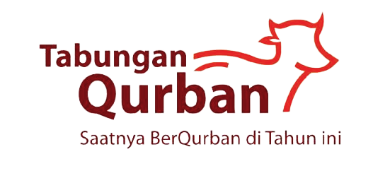

## About dQurban
* It is an administrative application for recording savings for Qurban
* This application is adapted to the needs of residents of the Grand Diosi 999 Housing located in Rejang Lebong, Bengkulu, Indonesia

## Screenshot
__No Available__

## Credits
- [Laravel 8](https://laravel.com/docs/8.x "Laravel 8")
- [Tabler](https://tabler.io/ "Tabler")
- [Laravel Sweet Alert](https://realrashid.github.io/sweet-alert/ "Laravel Sweet Alert")
- [Ramsey UUID](https://github.com/ramsey/uuid "Ramsey UUID")

## Contribute
You can read this article : [Fork a Repo](https://help.github.com/en/articles/fork-a-repo "Fork a Repo")

## How to Install
- Clone the repo : `git clone https://github.com/oimtrust/dqurban`
- Copy .env.example to .env : `sudo cp .env.example .env`
- Set your database in .env file :
  ```
  DB_DATABASE=your_db
  DB_USERNAME=your_username
  DB_PASSWORD=your_password_of_db
  ```
- Run the command `composer install` to install all the dependencies
- Run the command `php artisan key:generate` to generate the new key
- Run the command `php artisan migrate`
- Run the command `php artisan storage:link`
- Run the command `php artisan serve`. This will open dQurban app in your browser
- Make your valuable contribution
- Submit a pull request.

## License
The dQurban App is open-source software licensed under the [MIT license](https://opensource.org/licenses/MIT).
